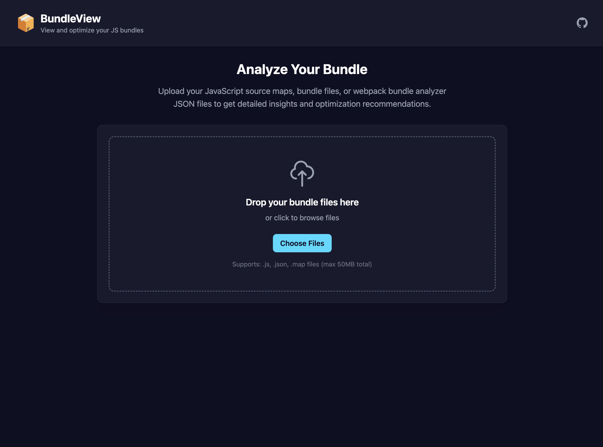

# 🚀 BundleView

**View and optimize your JavaScript bundles with detailed insights and optimization recommendations**

[](https://bundleview.dev)
[](https://opensource.org/licenses/MIT)
[](https://www.typescriptlang.org/)
[](https://react.dev/)
[](https://tailwindcss.com/)

## 📖 Overview

BundleView is a powerful, modern web application that helps developers analyze and optimize their JavaScript bundles. Whether you're working with webpack, Vite, or any other bundler, BundleView provides detailed insights into your bundle composition, identifies optimization opportunities, and offers actionable recommendations to improve performance.

<p align="center">
  
  
</p>

## ✨ Features

### 🔍 **Bundle Analysis**

- **Multiple File Format Support**: Analyze webpack bundle analyzer JSON files, JavaScript source maps, and compiled bundle files (one at a time)
- **Fast Processing**: Quick analysis with detailed breakdowns of your bundle structure
- **Key Metrics**: Total size, gzipped size, module count, and chunk information

### 📊 **Visual Insights**

- **Interactive Treemap**: Visual representation of your bundle modules with size-based hierarchy
- **File Explorer**: Detailed breakdown of individual files and their contributions
- **Statistics Panel**: Detailed metrics and performance indicators

### 💡 **Optimization Insights**

- **Smart Recommendations**: Data-driven suggestions for bundle optimization
- **Performance Analysis**: Identify large dependencies, code splitting opportunities, and tree shaking potential
- **Duplicate Detection**: Find and eliminate redundant code in your bundles
- **Compression Analysis**: Evaluate gzip efficiency and compression ratios

## 🚀 Getting Started

### Prerequisites

- Node.js 18+
- npm or yarn

### Installation

1. **Clone the repository**

   ```bash
   git clone https://github.com/bradtraversy/bundleview.git
   cd bundleview
   ```

2. **Install dependencies**

   ```bash
   npm install
   ```

3. **Start the development server**

   ```bash
   npm run dev
   ```

4. **Open your browser**
   Navigate to `http://localhost:3000`

### Building for Production

```bash
npm run build
npm run preview
```

## 📁 Supported File Types

### 1. **Compiled Bundle Files (.js)**

- Direct analysis of minified/compiled bundles
- Fallback analysis when detailed metadata isn't available
- Estimates module structure and sizes

### 2. **JavaScript Source Maps (.js.map)**

- Generated during build processes
- Maps compiled code back to source
- Useful for understanding bundle composition

### 3. **Webpack Bundle Analyzer JSON**

- Export from webpack-bundle-analyzer
- Contains detailed module information and dependencies
- Provides the most detailed analysis

## 🎯 How to Use

### Step 1: Upload Your Bundle

- Drag and drop your bundle files onto the upload area
- Or click to browse and select files from your system
- Support for multiple file types (analyze one file at a time)

### Step 2: Review Analysis

- **Insights Tab**: View optimization recommendations and performance insights
- **Treemap Tab**: Visual representation of bundle structure and module sizes
- **Files Tab**: Detailed breakdown of individual files and their contributions

### Step 3: Optimize Your Bundle

- Follow the provided recommendations
- Implement code splitting strategies
- Remove duplicate dependencies
- Optimize large modules

## 🏗️ Architecture

### **Frontend Stack**

- **React 19+**: Latest React with automatic optimizations
- **TypeScript**: Full type safety and better developer experience
- **Tailwind CSS 4**: Modern utility-first CSS framework
- **Vite**: Fast build tool and development server

### **Core Components**

- **BundleAnalysis**: Main orchestrator component
- **FileUpload**: Drag-and-drop file handling
- **Treemap**: D3.js-powered bundle visualization
- **InsightsPanel**: Optimization recommendations
- **StatisticsPanel**: Detailed metrics and tooltips

### **Data Processing**

- **BundleAnalyzer**: Core analysis engine
- **Module Processing**: Intelligent file type detection
- **Insight Generation**: Data-driven optimization suggestions

## 🔧 Configuration

### **Build Configuration**

The project uses Vite with optimized settings for:

- Fast development builds
- Efficient production builds
- Tree shaking and code splitting
- Asset optimization

## 📊 Performance Features

### **Bundle Analysis**

- **Module Size Tracking**: Monitor individual module sizes
- **Dependency Analysis**: Identify large third-party packages
- **Code Splitting**: Analyze chunk distribution and opportunities
- **Tree Shaking**: Evaluate unused code elimination potential

### **Optimization Insights**

- **Compression Efficiency**: Gzip ratio analysis
- **Duplicate Detection**: Find redundant code and dependencies
- **Performance Estimates**: Load time and performance impact calculations
- **Caching Strategies**: Recommendations for better caching

## 🤝 Contributing

We welcome contributions! Here's how you can help:

### **Development Setup**

1. Fork the repository
2. Create a feature branch: `git checkout -b feature/amazing-feature`
3. Make your changes
4. Add tests if applicable
5. Commit your changes: `git commit -m 'Add amazing feature'`
6. Push to the branch: `git push origin feature/amazing-feature`
7. Open a Pull Request

### **Code Style**

- Use TypeScript for all new code
- Follow existing component patterns
- Ensure mobile-first responsive design
- Add proper error handling
- Include helpful tooltips and documentation

### **Testing**

- Test with various bundle types and sizes
- Verify responsive design on different devices
- Ensure accessibility standards are met

## 🐛 Known Issues & Limitations

### **Current Limitations**

- Maximum file size: Limited by browser memory constraints
- Browser memory constraints for very large bundles
- Limited support for non-JavaScript bundle types

### **Planned Improvements**

- Support for CSS-only bundles
- Advanced dependency graph visualization
- Integration with popular build tools
- Performance benchmarking tools

## 📈 Roadmap

### **v1.1 - Enhanced Analysis**

- [ ] CSS bundle analysis
- [ ] Advanced dependency graphs
- [ ] Performance benchmarking
- [ ] Export analysis reports

### **v1.2 - Developer Experience**

- [ ] VS Code extension
- [ ] CLI tool
- [ ] CI/CD integration
- [ ] Team collaboration features

### **v1.3 - Advanced Features**

- [ ] Bundle comparison tools
- [ ] Historical analysis tracking
- [ ] Custom optimization rules
- [ ] Plugin system

## 🆘 Support

### **Getting Help**

- **Issues**: [GitHub Issues](https://github.com/bradtraversy/bundleview/issues)
- **Discussions**: [GitHub Discussions](https://github.com/bradtraversy/bundleview/discussions)
- **Documentation**: [Wiki](https://github.com/bradtraversy/bundleview/wiki)

### **Common Questions**

- **Q**: Why isn't my bundle analyzing correctly?
- **A**: Ensure you're using a supported file format and the file isn't corrupted

- **Q**: Can I analyze multiple bundles at once?
- **A**: Currently, BundleView analyzes one file at a time. Multiple file support is planned for future versions.

- **Q**: How accurate are the size estimates?
- **A**: Estimates are based on industry standards and actual compression ratios

## 📄 License

This project is licensed under the MIT License - see the [LICENSE](LICENSE) file for details.

## 🙏 Acknowledgments

- **D3.js**: For powerful data visualization capabilities
- **Tailwind CSS**: For the beautiful, responsive design system
- **Vite**: For the fast, modern build tooling
- **React Team**: For the amazing framework that makes this possible

---

**Made with ❤️ by [Brad Traversy](https://github.com/bradtraversy)**

If you find BundleView helpful, please consider giving it a ⭐ star on GitHub!
